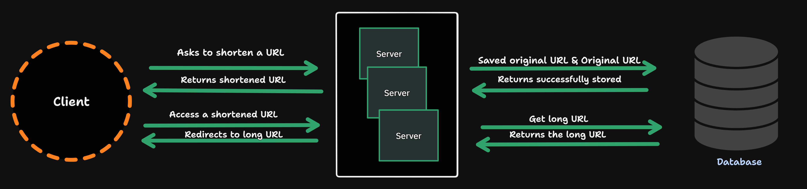

# URL Shortener

A lightweight URL shortening service that allows users to convert long URLs into shorter, shareable links and retrieve the original URLs via redirection. This project also explores Go’s `sync` package and concurrency patterns.

## 🚀 Features

- **Shorten a URL**  
  Accepts a long URL and returns a short, unique identifier.
- **Redirect to Original URL**  
  Visiting a short URL redirects the client to the original long URL.

- **Persistent Storage**  
  PostgreSQL integration planned via GORM to persist URL mappings.

- **In-Memory Storage**  
  URL mappings are stored in a Go map with concurrency-safe access using `sync.RWMutex` or `sync.Map`. 

- **RESTful API Endpoints**  
  - `POST /shorten` – Accepts a JSON payload with a long URL and returns a shortened URL.  
  - `GET /{shortCode}` – Redirects to the original URL.  
  - `GET /stats/{shortCode}` – Returns usage stats for a shortened URL.

The system includes:
- **External Entities:** Clients making API requests.
- **Processes:** Backend services handling URL creation and redirection logic.
- **Data Stores:** In-memory map or PostgreSQL DB to store mappings.
- **Data Flow:** Routes between entities and processes for URL submission and resolution.

> See the system design image for a high-level overview.
